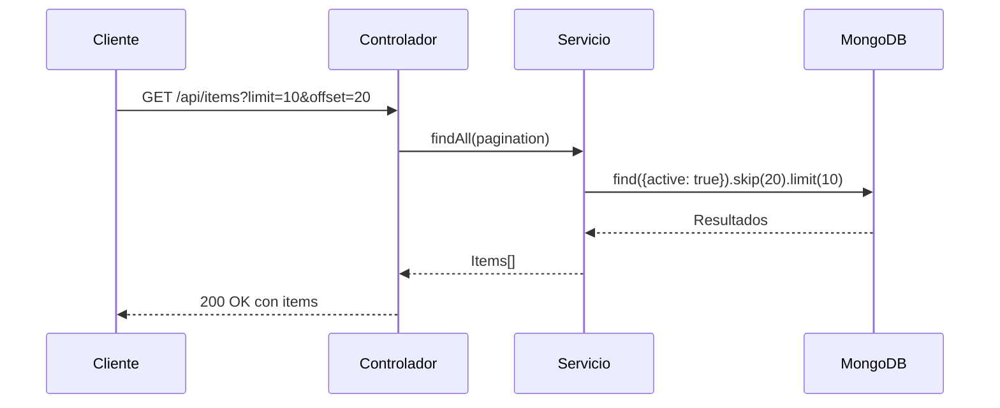

# Proyecto Base NestJS

## Descripción

Proyecto base para construir APIs con NestJS, preconfigurado con las mejores prácticas de desarrollo y listo para producción.

## Características Principales

- **Arquitectura limpia**: Estructura modular siguiendo principios SOLID
- **Configuración centralizada**: Variables de entorno validadas y tipadas
- **Observabilidad**: Métricas, logs y tracing con OpenTelemetry
- **Seguridad**: Helmet, CORS y rate limiting preconfigurados
- **Docker**: Configuración lista para producción con Docker Compose
- **Pruebas**: Unitarias y E2E con Jest
- **Documentación**: OpenAPI (Swagger) integrado

## Stack Tecnológico

| Tecnología       | Versión  | Uso                              |
|------------------|----------|----------------------------------|
| Node.js          | 20.x     | Entorno de ejecución            |
| NestJS           | 10.x     | Framework principal             |
| MongoDB          | 8.0.3    | Base de datos NoSQL             |
| TypeScript       | 5.x      | Lenguaje principal              |
| Jest             | 29.x     | Pruebas unitarias y E2E         |
| Docker           | 24.x     | Contenerización                 |
| OpenTelemetry    | 1.x      | Observabilidad                  |
| Swagger          | 7.x      | Documentación API               |

## Configuración Inicial

### Requisitos

- Node.js 20.x
- Docker y Docker Compose
- Yarn o npm
- Git (para control de versiones)
- OpenSSL (para generación de certificados)

### Consideraciones de Seguridad

- **Certificados TLS**: Generar certificados autofirmados para desarrollo:
```bash
openssl req -x509 -newkey rsa:4096 -keyout key.pem -out cert.pem -days 365 -nodes
```

- **Variables Sensibles**: Nunca comitear archivos .env
- **Rate Limiting**: Habilitado por defecto (1000 req/min)
- **CORS**: Configurado para desarrollo local
- **Helmet**: Middleware de seguridad HTTP habilitado

### Instalación

1. Clonar repositorio:
```bash
git clone https://github.com/iromanm1982/nest-project-base
cd tu-repositorio
```

2. Instalar dependencias:
```bash
yarn install
# o
npm install
```

3. Configurar entorno:
```bash
cp .env.example .env
# Editar .env con tus valores
```

4. Iniciar servicios:
```bash
docker-compose up -d
```

5. Ejecutar en desarrollo:
```bash
yarn start:dev
# o
npm run start:dev
```

6. Script de construcción:
El proyecto incluye un script de construcción multiplataforma con los siguientes modos:

- **Modo CI/CD**: Ejecuta todas las etapas de construcción
```bash
./build.sh ci
```

- **Modo local**: Instala dependencias y compila el proyecto
```bash
./build.sh local
```

- **Modo Docker**: Solo construye la imagen Docker
```bash
./build.sh docker
```

## Documentación API

La documentación interactiva está disponible en:

- Desarrollo: http://localhost:3000/docs
- Producción: https://tudominio.com/docs

### Ejemplos de Uso

#### Obtener items
```bash
curl -X GET "http://localhost:3000/api/items" \
  -H "Accept: application/json"
```

#### Crear item
```bash
curl -X POST "http://localhost:3000/api/items" \
  -H "Content-Type: application/json" \
  -d '{"name": "Item 1", "description": "Descripción del item"}'
```

## Módulo de Items

El módulo de items es el núcleo de la aplicación, encargado de gestionar los recursos principales del sistema.

### Estructura del Módulo

```
src/items/
├── items.controller.ts    # Controlador REST
├── items.service.ts       # Lógica de negocio
├── items.module.ts        # Configuración del módulo
├── schemas/               # Esquemas de MongoDB
│   └── item.schema.ts     # Esquema principal
├── dtos/                  # Data Transfer Objects
└── features/              # Pruebas BDD
```

### Características Principales

- **CRUD completo**: Crear, leer, actualizar y eliminar items
- **Paginación**: Soporte para paginación con limit y offset
- **Soft-delete**: Borrado lógico mediante campo active
- **Validaciones**: Esquema validado con Mongoose
- **Documentación**: Swagger completo con ejemplos

### Flujo de Operaciones



### Ejemplos de Uso Actualizados

#### Obtener items paginados
```bash
curl -X GET "http://localhost:3000/api/items?limit=10&offset=20" \
  -H "Accept: application/json"
```

#### Crear item
```bash
curl -X POST "http://localhost:3000/api/items" \
  -H "Content-Type: application/json" \
  -d '{
    "name": "Item 1",
    "description": "Descripción del item"
  }'
```

#### Desactivar item (soft-delete)
```bash
curl -X PATCH "http://localhost:3000/api/items/64b8f5f5e4b0a1a2b3c4d5e6" \
  -H "Content-Type: application/json" \
  -d '{"active": false}'
```

## Estructura del Proyecto

```
.
├── src/
│   ├── common/          # Código compartido
│   ├── config/          # Configuración
│   ├── database/        # Conexión DB y seeds
│   ├── health/          # Health checks
│   ├── items/           # Módulo principal
│   ├── metrics/         # Métricas y observabilidad
│   ├── app.module.ts    # Módulo raíz
│   └── main.ts          # Punto de entrada
├── test/                # Pruebas E2E
├── docker/              # Configuración Docker
└── docs/                # Documentación adicional
```

## Variables de Entorno

| Variable            | Descripción                          | Ejemplo                     |
|---------------------|--------------------------------------|-----------------------------|
| NODE_ENV            | Entorno de ejecución                | development                 |
| PORT                | Puerto de la aplicación             | 3000                        |
| MONGODB_URI         | URL de conexión MongoDB             | mongodb://localhost:27017   |
| MONGODB_DB_NAME     | Nombre de la base de datos          | nestjs                      |
| LOG_LEVEL           | Nivel de logging                    | debug                       |
| ENABLE_RATE_LIMIT   | Habilitar rate limiting             | true                        |
| CORS_ORIGIN         | Orígenes permitidos para CORS       | http://localhost:3000       |
| OTLP_ENDPOINT       | Endpoint OpenTelemetry              | http://localhost:4318       |
| JAEGER_AGENT_HOST   | Host del agente Jaeger              | localhost                   |
| JAEGER_AGENT_PORT   | Puerto del agente Jaeger            | 6832                        |
| PROMETHEUS_PORT     | Puerto para métricas Prometheus     | 9090                        |

## Configuración de Observabilidad

La aplicación está preconfigurada con OpenTelemetry para:

- **Tracing**: Seguimiento distribuido de peticiones
- **Métricas**: Exportación a Prometheus
- **Logs**: Centralización y correlación

### Configuración de Jaeger

1. Iniciar Jaeger localmente:
```bash
docker run -d --name jaeger \
  -e COLLECTOR_ZIPKIN_HOST_PORT=:9411 \
  -e COLLECTOR_OTLP_ENABLED=true \
  -p 6831:6831/udp \
  -p 6832:6832/udp \
  -p 5778:5778 \
  -p 16686:16686 \
  -p 4317:4317 \
  -p 4318:4318 \
  -p 14250:14250 \
  -p 14268:14268 \
  -p 14269:14269 \
  -p 9411:9411 \
  jaegertracing/all-in-one:1.48
```

2. Visualizar trazas:
```bash
open http://localhost:16686
```

### Configuración de Prometheus

1. Iniciar Prometheus:
```bash
docker run -d --name prometheus \
  -p 9090:9090 \
  -v $(pwd)/prometheus.yml:/etc/prometheus/prometheus.yml \
  prom/prometheus
```

2. Visualizar métricas:
```bash
open http://localhost:9090
```

## Migraciones de Base de Datos

El proyecto utiliza Mongoose como ODM para MongoDB. Para gestionar cambios en el esquema de la base de datos:

1. Crear archivo de migración en `src/database/migrations/`:
```typescript
import { Connection } from 'mongoose';

export async function up(connection: Connection) {
  await connection.db.collection('items').updateMany(
    {},
    { $set: { active: true } }
  );
}

export async function down(connection: Connection) {
  await connection.db.collection('items').updateMany(
    {},
    { $unset: { active: '' } }
  );
}
```

2. Ejecutar migración:
```bash
yarn migrate:up
# o
npm run migrate:up
```

3. Revertir migración:
```bash
yarn migrate:down
# o
npm run migrate:down
```

### Consideraciones de Escalabilidad

- **Sharding**: Configuración recomendada para colecciones grandes:
```javascript
sh.enableSharding("nestjs")
sh.shardCollection("nestjs.items", { _id: "hashed" })
```

- **Índices**: Crear índices para consultas frecuentes:
```typescript
await connection.db.collection('items').createIndex(
  { name: 1 },
  { unique: true }
);
```

- **Caching**: Integración con Redis para caché:
```typescript
import { CacheModule } from '@nestjs/cache-manager';
import * as redisStore from 'cache-manager-redis-store';

@Module({
  imports: [
    CacheModule.register({
      store: redisStore,
      host: 'localhost',
      port: 6379,
      ttl: 60, // Tiempo de vida en segundos
    }),
  ],
})
export class AppModule {}
```

## Integración Continua (CI/CD)

El proyecto incluye configuración base para:

- **GitHub Actions**: Ejecución de pruebas y despliegues
- **Docker Hub**: Publicación automática de imágenes
- **SonarCloud**: Análisis estático de código

### Configuración de GitHub Actions

1. Crear archivo .github/workflows/ci.yml:
```yaml
name: CI Pipeline

on:
  push:
    branches: [ main ]
  pull_request:
    branches: [ main ]

jobs:
  test:
    runs-on: ubuntu-latest
    steps:
      - uses: actions/checkout@v3
      - uses: actions/setup-node@v3
        with:
          node-version: 20
      - run: yarn install
      - run: yarn test
      - run: yarn build

  docker:
    needs: test
    runs-on: ubuntu-latest
    steps:
      - uses: actions/checkout@v3
      - name: Login to Docker Hub
        uses: docker/login-action@v2
        with:
          username: ${{ secrets.DOCKER_HUB_USERNAME }}
          password: ${{ secrets.DOCKER_HUB_TOKEN }}
      - name: Build and push
        uses: docker/build-push-action@v4
        with:
          push: true
          tags: ${{ secrets.DOCKER_HUB_USERNAME }}/nestjs-base:latest
```

2. Configurar secrets en GitHub:
- DOCKER_HUB_USERNAME
- DOCKER_HUB_TOKEN

## Recursos y Referencias

- [Documentación Oficial NestJS](https://docs.nestjs.com)
- [Guía de Estilo TypeScript](https://google.github.io/styleguide/tsguide.html)
- [Best Practices MongoDB](https://www.mongodb.com/developer/products/mongodb/mongodb-best-practices/)
- [OpenTelemetry Docs](https://opentelemetry.io/docs/)
- [Swagger Documentation](https://swagger.io/docs/)

## Contribución

1. Haz fork del proyecto
2. Crea tu rama (`git checkout -b feature/nueva-funcionalidad`)
3. Haz commit de tus cambios (`git commit -am 'Agrega nueva funcionalidad'`)
4. Haz push a la rama (`git push origin feature/nueva-funcionalidad`)
5. Abre un Pull Request

## Licencia

[MIT](https://choosealicense.com/licenses/mit/)

## Contacto

- Iván Muerte
  - [LinkedIn](https://www.linkedin.com/in/ivan-muerte-roman/)
  - [Twitter](https://twitter.com/ivanmuerte)
