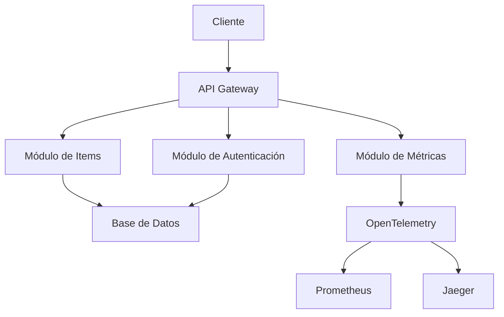
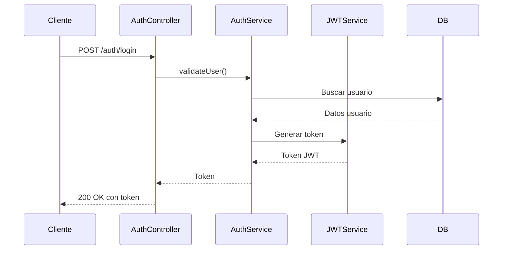
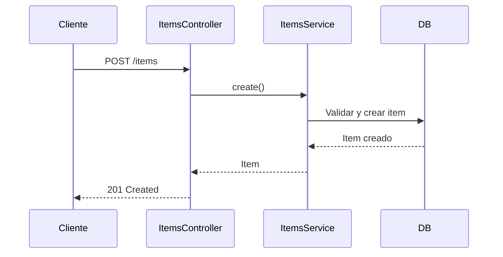

# Arquitectura del Proyecto

## Diseño del Sistema

### Principios de Diseño

- **Modularidad**: Cada funcionalidad está encapsulada en módulos independientes
- **SOLID**: Aplicación de principios SOLID en toda la estructura
- **Capa de Dominio**: Separación clara entre lógica de negocio y presentación
- **Inversión de Dependencias**: Uso de inyección de dependencias

### Diagrama de Arquitectura



## Estructura del Proyecto

```
.
├── src/
│   ├── common/          # Código compartido
│   │   ├── dtos/        # Data Transfer Objects
│   │   ├── filters/     # Filtros globales
│   │   ├── guards/      # Guards de autenticación
│   │   ├── interceptors/# Interceptores
│   │   └── pipes/       # Pipes de validación
│   ├── config/          # Configuración
│   ├── database/        # Conexión DB y seeds
│   ├── health/          # Health checks
│   ├── items/           # Módulo principal
│   ├── metrics/         # Métricas y observabilidad
│   ├── app.module.ts    # Módulo raíz
│   └── main.ts          # Punto de entrada
├── test/                # Pruebas E2E
├── docker/              # Configuración Docker
└── docs/                # Documentación adicional
```

## Flujos Principales

### Flujo de Autenticación



### Flujo de Creación de Items



## Patrones de Diseño

1. **Inyección de Dependencias**: Uso intensivo de DI para desacoplar componentes
2. **Repository Pattern**: Para acceso a datos
3. **Strategy Pattern**: En manejo de autenticación
4. **Observer Pattern**: Para métricas y observabilidad
5. **Decorator Pattern**: En interceptores y guards

[Volver al índice](../docs/README.md)
